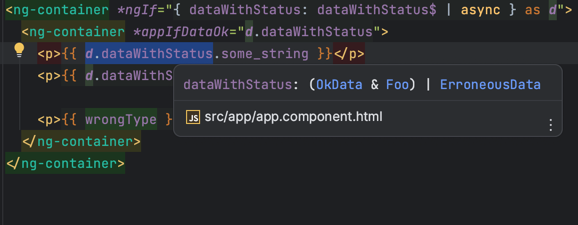
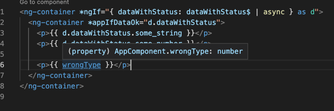

# WebStorm bug report

Template type checking bugs in `app.component.html`

## First bug

WebStorm erroneously reports `d.dataWithStatus` as a non-narrowed `(OkData & Foo) | ErroneousData`.

Compare with VS Code with the official Angular language service:

## Second bug

WebStorm erroneously adds the directive's context (or something), which causes `wrongType` to become an impossible `number & OkData`:

Compare with VS Code with the official Angular language service:

